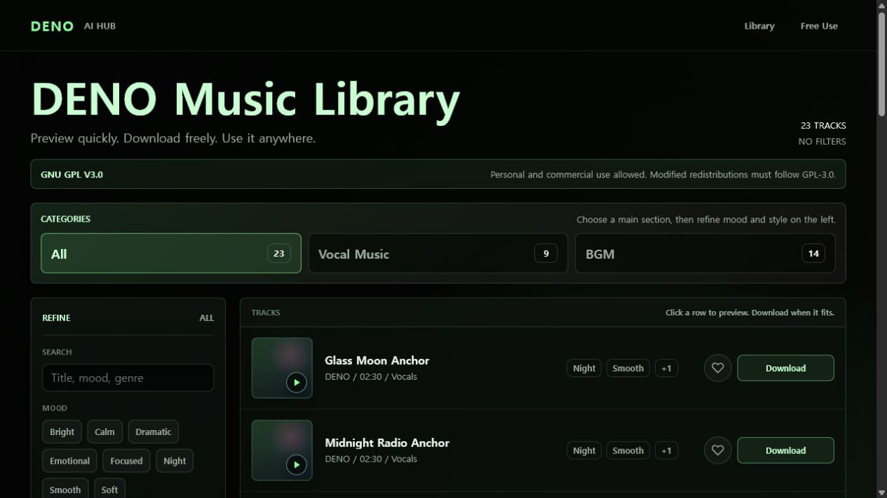

# DENO Music Library

Preview, organize, and download DENO's AI-generated music from a practical browser library.

**[Open DENO Music Library](https://deno2026.github.io/DENO-Music-Library/)**



The current public library contains **23 tracks**: **14 BGM tracks** and **9 vocal tracks**.

## How to Use

1. Open the [live library](https://deno2026.github.io/DENO-Music-Library/), then choose **All**, **Vocal Music**, or **BGM**. Search by title or narrow the list by mood and style.
2. Select a track or its play button to preview it. Use the heart button to keep useful tracks in your browser favorites.
3. Select **Download** beside the track you want to save.

## What You Can Do

- Preview all tracks directly in the browser.
- Filter by category, mood, style, search text, or favorites.
- Use the persistent player for previous, next, repeat, volume, and favorite controls.
- Download individual tracks without creating an account.

## License

DENO-owned tracks, site source, documentation, and project-local assets in this repository are released under [GNU GPL v3.0](LICENSE) (`GPL-3.0-only`). Personal and commercial use is allowed. If you distribute modified versions, you must follow GPL-3.0 and preserve the applicable copyright and license notices.

Third-party tools, services, models, datasets, and externally hosted assets keep their own licenses and terms. Check the applicable terms before using or redistributing them.

## Developer Notes

The public page is a static site. `tracks.json` stores track metadata, while the audio files are hosted separately on Cloudflare R2; MP3 and WAV files are not stored in this GitHub repository.

### Local Preview

Run a local static server from this folder:

```powershell
python -m http.server 8877 --bind 127.0.0.1
```

Then open `http://127.0.0.1:8877/`.

### Validate Metadata

```powershell
node scripts/validate-tracks.mjs
node --check app.js
```
